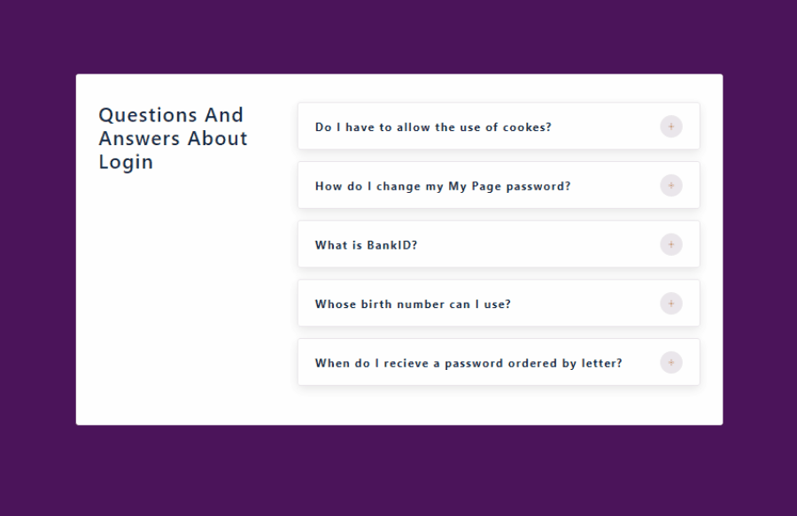

#### Accordion project in React

[view page](https://femi-ologunwa.github.io/-4-accordion/)



#### Implementation

1. How to use react react-icons.

```
npm install react-icons --save
```

```javascript
import { FaHome } from 'react-icons/fa';
const Component = () => {
   return <FaHome className='icon'></FaHome>;
};
```

2. fetching data from a file.

3. implement toggle functionality depending on a state value.

4. using spread operator to pass properties of an object (from data file) as props to a component
